```verilog
module top_module(
	input a,
	input b,
	input c,
	output w,
	output x,
	output y,
	output z);
	
	assign w = a;
	assign x = b;
	assign y = b;
	assign z = c;
endmdule
```


其中可以化简：如果确定每个信号的宽度，则使用连接运算符等效更简单。

```verilog
module top_module(
	input a,b,c,
	output w,x,y,z);
	
	assign {w,x,y,z} = {a,b,b,c};
endmdule
```


**非门：**
1. 按位非 ~（bitwise NOT）  
	对操作数的每一个 bit 分别取反，结果的位宽和操作数相同。比如对一个 4 位信号 `a = 4'b1010`，`~a` 的结果是 `4'b0101`——每一位都翻转。
2. 逻辑非 !（logical NOT）  
	把整个操作数当作一个"真/假"来判断，结果永远是 1 位。只要操作数中有任何一位是 1（即非零），就当作"真"，`!` 的结果为 0；如果操作数全为 0（即"假"），`!` 的结果为 1。比如 `a = 4'b1010`（非零），`!a` 的结果是 `1'b0`。

**与门：**
1. 按位与 &（bitwise AND）  
	把两个操作数对应位置的 bit 一一配对做与运算，结果位宽等于较宽的那个操作数。比如 `a = 4'b1100`、`b = 4'b1010`，那么 `a & b` 得到 `4'b1000`——第 3 位两边都是 1 所以留 1，其余位至少有一边是 0 所以为 0。
2. 逻辑与 &&（logical AND）  
	把两个操作数各自整体判断成"真/假"（非零为真，全零为假），然后做与运算，结果永远是 1 位。同样是 `a = 4'b1100`、`b = 4'b1010`，两者都非零，所以都算"真"，`a && b` 的结果是 `1'b1`。

**或非门：** 不要混着用符号
1. 按位或非 ~ |（bitwise NOR）  
2. 逻辑或非 ！ ||（logical NOR）

**异或：**
按位异或"^"，不存在逻辑异或。

**声明wires：**

`声明了一个名为`w`的 8 位向量` 
格式：

```

```verilog
wire [7:0] w;         // 8-bit wire
reg  [4:1] x;         // 4-bit reg
output reg [0:0] y;   // 1-bit reg that is also an output port (this is still a vector)
input wire [3:-2] z;  // 6-bit wire input (negative ranges are allowed)
output [3:0] a;       // 4-bit output wire. Type is 'wire' unless specified otherwise.
wire [0:7] b;         // 8-bit wire where b[0] is the most-significant bit.
```

这个语句需要在输入输出的外面

```verilog
`default_nettype none
module top_module(
    input a, b，
    output out  
	);
    wire and_out1;    //在外面声明

    assign and_out1 = a && b;
    assign out = ! and_out1;

endmodule
```


举例：题目链接：[矢量门](https://hdlbits.01xz.net/wiki/Vectorgates)

b放高位，a放低位：

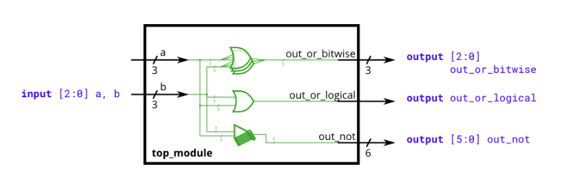


```verilog
module top_module( 
    input [2:0] a,
    input [2:0] b,
    output [2:0] out_or_bitwise,
    output out_or_logical,
    output [5:0] out_not
);
    assign out_or_bitwise[2:0] = a[2:0] | b[2:0];
    assign out_or_logical = a[2:0] || b[2:0];
    assign out_not[5:3] = ~ b[2:0];
    assign out_not[2:0] = ~ a[2:0];

endmodule
```

可以简化：位宽已经对应了，可以改为 a|b；a||b这样子。


**连接运算符：** {a,b,c}用于将向量的较小部分连接起来，从而创建更大的向量。

```verilog
{3'b111, 3'b000} => 6'b111000 
{1'b1, 1'b0, 3'b101} => 5'b10101 
{4'ha, 4'd10} => 8'b10101010 // 4'ha 和 4'd10 的二进制表示均为 4'b1010
```

多次复制的简介方式：

```verilog
assign a = {b,b,b,b,b,b}; //这样更繁琐
{num{vector}}             //此操作将向量复制_num__次_。num_必须_为常量。两组大括号都是必需的。
{5{1'b1}} // 5'b11111（或 5'd31 或 5'h1f）
{2{a,b,c}} // 与 {a,b,c,a,b,c} 相同
```


要注意：这里的assign中需要在24{in[7]}外面再加一个大的{}，才行。

```verilog
module top_module (
    input [7:0] in,
    output [31:0] out );
	
    assign out[31:0] = {{24{in[7]}},in[7:0]};

endmodule
```


题目链接：[模块](https://hdlbits.01xz.net/wiki/Module)

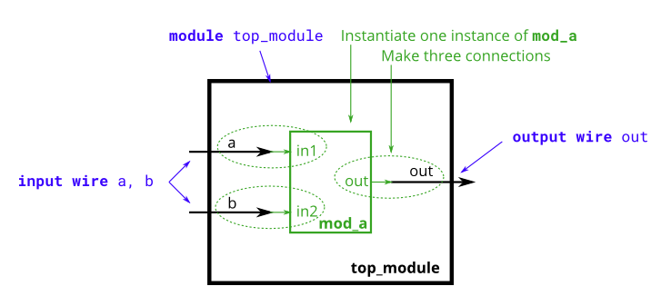


模块层级结构是通过将一个模块实例化到另一个模块中而创建的：
注意这里的方式：.in1(a) 是大的在里面小的在外面。
```verilog
module top_module (
	input a,
	input b,
	output out
);

	// Create an instance of "mod_a" named "inst1", and connect ports by name:
	mod_a inst1 ( 
		.in1(a), 	// Port"in1"connects to wire "a"
		.in2(b),	// Port "in2" connects to wire "b"
		.out(out)	// Port "out" connects to wire "out" 
				// (Note: mod_a's port "out" is not related to top_module's wire "out". 
				// It is simply coincidence that they have the same name)
	);

/*
	// Create an instance of "mod_a" named "inst2", and connect ports by position:
	mod_a inst2 ( a, b, out );	// The three wires are connected to ports in1, in2, and out, respectively.
*/
	
endmodule
```


题目链接：[按名称连接端口](https://hdlbits.01xz.net/wiki/Module_name)
举例：只有位置信息，并没给端口的名字。

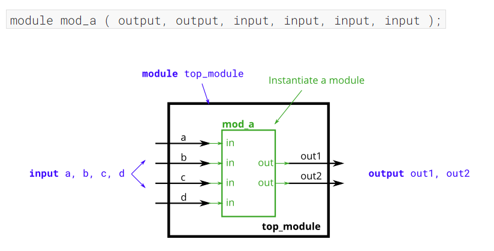


```verilog
module top_module ( 
    input a, 
    input b, 
    input c,
    input d,
    output out1,
    output out2
);
    //mod_a inst1(.out(out1), .out(out2), .in(a), .in(b), .in(c), .in(d));不对
    mod_a instant1 ( out1, out2, a, b, c, d );
endmodule
```

>[!warning] 问题
>1.隐藏的两行的问题就是，没有给mod_a中任何一个端口起名字，只给出了端口的位置，所以只能按照位置信息来写。
>2.同一个端口名.out和.in重复使用了多次，Verilog不允许在一次实例化中重复连接同名端口。


这个图就是按照名字来连接的：

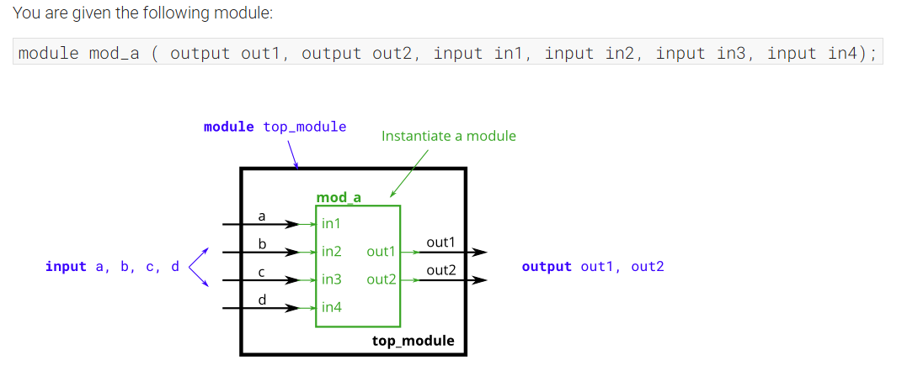


```verilog
module top_module ( 
    input a, 
    input b, 
    input c,
    input d,
    output out1,
    output out2
);
    mod_a inst1(.in1(a), .in2(b), .in3(c), .in4(d), .out1(out1), .out2(out2));
    //mod_a inst(out1, out2, a, b, c, d);
endmodule

```


题目链接：[三个模块](https://hdlbits.01xz.net/wiki/Module_shift)
内部模块连接的写法：

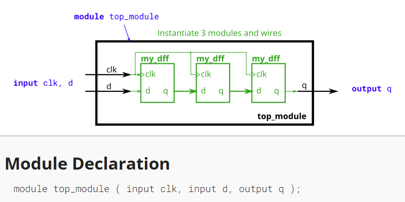

```verilog
module top_module ( input clk, input d, output q );

    wire out1,out2;
    my_dff inst1(.clk(clk), .d(d), .q(out1));
    my_dff inst2(.clk(clk), .d(out1), .q(out2));
    my_dff inst3(.clk(clk), .d(out2), .q(q));
    
    //也可以这么写，直接按顺序
	//wire a, b;
	//my_dff d1 ( clk, d, a );
	//my_dff d2 ( clk, a, b );
	//my_dff d3 ( clk, b, q );
endmodule
```


题目链接：[模块和向量](https://hdlbits.01xz.net/wiki/Module_shift8)

数据选择器的写法：使用always @( * )  begin

```verilog
module top_module ( 
    input clk, 
    input [7:0] d, 
    input [1:0] sel, 
    output [7:0] q 
);
    wire [7:0] a;
    wire [7:0] b;
    wire [7:0] c;
    my_dff8 inst1(clk, d[7:0], a[7:0]);
    my_dff8 inst2(clk, a[7:0], b[7:0]);
    my_dff8 inst3(clk, b[7:0], c[7:0]);
    
    always @(*) 
    begin
        case (sel)
            2'b00: q[7:0] = d[7:0];
            2'b01: q[7:0] = a[7:0];            
            2'b10: q[7:0] = b[7:0];
            2'b11: q[7:0] = c[7:0];
        endcase
    end
endmodule

```

也可以简化：位数已经对齐了，就不用写了。

```verilog
module top_module (
    input clk,
    input [7:0] d,
    input [1:0] sel,
    output reg [7:0] q      // 注意加 reg
);
    wire [7:0] a, b, c;
    my_dff8 inst1(clk, d, a);
    my_dff8 inst2(clk, a, b);
    my_dff8 inst3(clk, b, c);

    always @(*) 
    begin
        case (sel)
            2'b00: q = d;   // 延迟 0 拍
            2'b01: q = a;   // 延迟 1 拍
            2'b10: q = b;   // 延迟 2 拍
            2'b11: q = c;   // 延迟 3 拍
        endcase
    end
endmodule
```


题目链接： [加法器](https://hdlbits.01xz.net/wiki/Module_fadd)
已经给了一个：(这里有加法器的写法) 
module add16 ( input[15:0] **a**, input[15:0] **b**, input **cin**, output[15:0] **sum**, output **cout** );
需要写add1和add16.

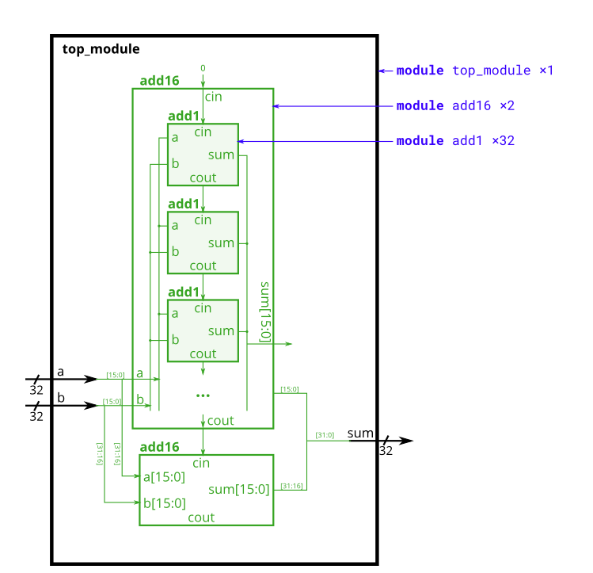


```verilog
module top_module (
    input [31:0] a,
    input [31:0] b,
    output [31:0] sum
);//
	wire x;
    add16 inst1(a[15:0], b[15:0], 0, sum[15:0], x);
    add16 inst2(a[31:16], b[31:16], x, sum[31:16]);
    
endmodule

module add1 ( input a, input b, input cin,   output sum, output cout );

// Full adder module here  加法器的写法
	assign sum = a ^ b ^ cin;
	assign cout = a&b | a&cin | b&cin;
endmodule
```


>[!add] 加法器
>如果以后写verilog的话可以将一些小东西写成固定的模块。比如说加法器。


[Module addsub](https://hdlbits.01xz.net/wiki/Module_addsub)

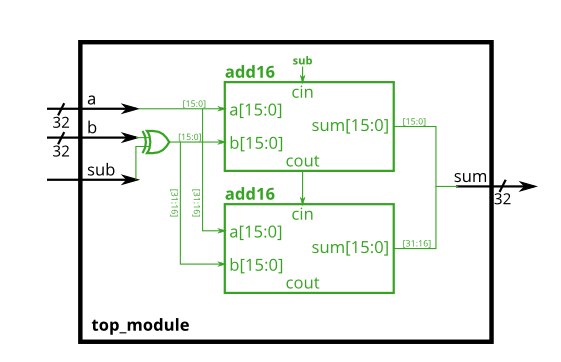

异或也可以这么写：

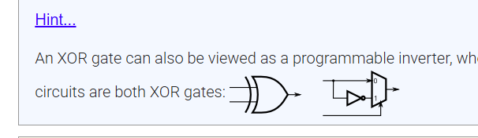


```verilog
module top_module(
    input [31:0] a,
    input [31:0] b,
    input sub,
    output [31:0] sum
);
    wire x;
    //wire [31:0] sub_b_out; 
    //assign sub_b_out[31:0] = {32{sub}} ^ b[31:0];
    
    reg [31:0] sub_b_out;
	always @(*) begin
    	case (sub)
        	1'b0: sub_b_out = b;
        	1'b1: sub_b_out = ~b;
    	endcase
	end
    
    add16 inst1(a[15:0], sub_b_out[15:0], sub, sum[15:0], x);
    add16 inst2(a[31:16], sub_b_out[31:16], x, sum[31:16]);
    
endmodule

```

>[!question] 
>1.异或门的写法，可以是用'^'，也可以是用一个数据选择器。
>2.`sub` 是 1 位，`b` 是 32 位。Verilog 在做 `sub ^ b[31:0]` 时会把 `sub` **零扩展**成 32 位（变成 `{31'b0, sub}`），结果只有最低位被取反，高 31 位原样通过。所以减法时只翻转了 b[0]，完全不对。


>[!important] reg和wire
>关于 wire 和 reg 的说明：赋值语句的左侧必须是_网络_类型（例如wire），而过程赋值（在 always 块中）的左侧必须是_变量_类型（例如reg）。这些类型（wire 和 reg）与所综合的硬件无关，只是 Verilog 作为硬件_仿真_语言时遗留下来的语法。
> * always 的左侧必须是reg类型；
> * assign 的左侧必须是wire类型


题目链接：[alwaysblock](https://hdlbits.01xz.net/wiki/Alwaysblock2)

* 连续赋值语句：(assign x = y) 只能在非非过程内部使用，不能在always中使用
* 过程块阻塞赋值语句：(x = y) 只能在过程内部使用，always
* 过程式非阻塞赋值： (x <= y) 只能在过程内部使用

阻塞和非阻塞的区别：
- 阻塞 `c = a+b`：这条语句当场把 `c` 写完，后面的语句被迫等它写完才执行 → 后面看到新 `c`
- 非阻塞 `c <= a+b`：右边 `a+b` 当场算完，但写 `c` 被推到时间步末尾，后面的语句不等它 → 后面看到旧 `c`
举例：
`c = a + b` or `c <= a + b` 的运算是完全相同的，因为它们都是在时钟上升沿瞬间 "保存输入初始值 (上升沿之前的值)"，然后进行运算 `a + b` 并赋值给 `c`。这里阻塞和非阻塞的区别体现在第二句 `e = c + d` or `e <= c + d` 上：
- 时序 + 非阻塞：等号右端所有用到的值，也即 `a, b, c, d` 都是上升沿时保存下来的初始值 (保存的是上升沿前一瞬间的值)，本次 `c + d` 运算 "看不到" `c <= a + b` 的新结果值；换句话说，本次 `c + d` 运算使用的是上次 `c <= a + b` 计算得到的值。 **等价于 `e_{n} = a_{n-1} + b_{n-1} + d_{n}` 的效果。**
- 时序 + 阻塞：时钟上升沿到来时，仅保存整个模块几个输入端口的初始值，也即 `a, b, d` 在上升沿被保存下来。语句 `e = c + d` 会先等待 `c` 完成更新，被赋值为 `a + b` 的新结果，然后才来计算 `c + d` 并赋值给 `e`，所以本次 `c + d` 运算 "看到了" 本次 `c = a + b` 的新结果值。 **等价于 `e = (a + b) + d`，也即 `e_{n} = a_{n} + b_{n} + d_{n}` 的效果。**

在**组合逻辑的**always 块中，使用**阻塞**赋值。在**时钟控制的**always 块中，使用**非阻塞**赋值。

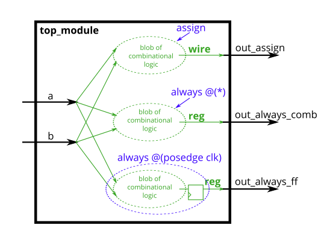


```verilog
// synthesis verilog_input_version verilog_2001
module top_module(
    input clk,
    input a,
    input b,
    output wire out_assign,
    output reg out_always_comb,
    output reg out_always_ff   );

    assign out_assign = a ^ b;
    always @(*) out_always_comb = a ^ b;
    always @(posedge clk) out_always_ff = a ^ b;
    
endmodule
```


题目链接：[always if](https://hdlbits.01xz.net/wiki/Always_if)

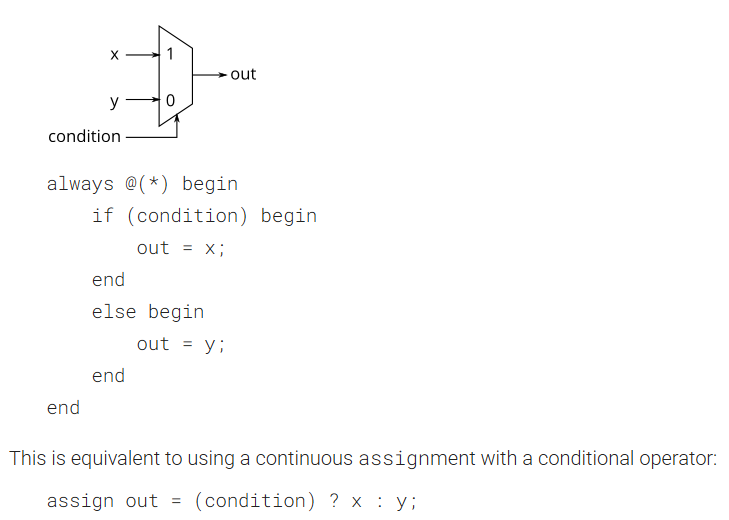

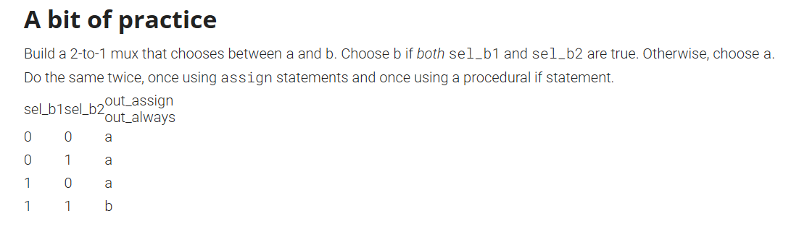


```verilog
// synthesis verilog_input_version verilog_2001
module top_module(
    input a,
    input b,
    input sel_b1,
    input sel_b2,
    output wire out_assign,
    output reg out_always   ); 

    always @(*) begin
        if (sel_b1 && sel_b2) begin
            out_always = b;
        end
        else begin
            out_always = a;
        end
    end
    
    assign out_assign = (sel_b1 && sel_b2) ? b:a;
    
    
endmodule
```

>[!error] 
>问题是你把**赋值 `=`** 当成了**比较 `==`**。

verilog
```verilog
if ({sel_b1,sel_b2} = 2'b11)   // ✗ 这是赋值语句，不是表达式
if ({sel_b1,sel_b2} == 2'b11)  // ✓ 相等比较
```

Verilog 里 `=` 只能作为独立的赋值语句出现，不能嵌在 `if` 的条件表达式里（不像 C 那样允许 `if (x = 1)`）。所以编译器看到括号里出现 `=` 就报语法错误。

>[!note] 
>**条件表达式判断的是"真/假"，不是"等于某个值"**。
>规则是：表达式的值只要非零就算真，为零就算假。`sel_b1` 是 1 位信号，只可能是 0 或 1，所以：
>- 写 `if (sel_b1)`，等价于 `if (sel_b1 == 1'b1)`
>- 写 `if (!sel_b1)`，等价于 `if (sel_b1 == 1'b0)`
>
所以 `sel_b1 && sel_b2` 读作"sel_b1 为真 **并且** sel_b2 为真"，对 1 位信号来说就是"两个都是 1"。多写一个 `== 1` 不算错，但属于冗余，就像中文里说"这个开关是打开的"而不用说"这个开关的状态等于打开"。
说它比 `{sel_b1,sel_b2} == 2'b11` 直观，是因为后者要先在脑子里做两步转换：把两个信号拼成一个 2 位数 → 再对照这个 2 位数是不是二进制 11。而 `&&` 直接对应题目那句话"Choose b if both sel_b1 and sel_b2 are true"，几乎是逐词翻译。
补充一个坑：对**多位**信号就不能省略了。比如 `data` 是 8 位，`if (data)` 的意思是"data 不等于 0"（任何一位为 1 都算真），而不是"data 等于 1"。这时候想比较具体数值就必须写 `if (data == 8'd1)`。只有 1 位信号才能安全地省略。


题目链接：[Alwaysif2](https://hdlbits.01xz.net/wiki/Always_if2)

锁存器（latch）的意外产生:

问题出在哪:看第一段代码：

```verilog
always @(*) begin
    if (cpu_overheated)
        shut_off_computer = 1;
end
```

你只说了"CPU 过热时，关机信号 = 1"。但没说 CPU 不过热时该等于几。
Verilog 遇到这种情况的处理规则是：没被赋值的情况，输出保持原来的值不变。

"保持不变"意味着电路必须记住上一次的值。而纯组合逻辑（与门、或门这些）是没有记忆能力的，所以综合工具只能给你插一个锁存器来存住这个值。这就是 Quartus 报的 `Warning (10240): inferring latch(es)`。

后果很荒谬：一旦 `cpu_overheated` 曾经为 1，`shut_off_computer` 就永远卡在 1 了，哪怕 CPU 早就凉下来——电脑再也开不了机。这显然不是你想要的电路。

核心规则
组合逻辑必须在所有条件下都给输出赋值。
实践上就是：`if` 一定要配 `else`，或者在 always 块开头先给个默认值。

改法:

```verilog
always @(*) begin
    if (cpu_overheated)
        shut_off_computer = 1;
    else
        shut_off_computer = 0;    // 补上 else
end

always @(*) begin
    if (~arrived)
        keep_driving = ~gas_tank_empty;
    else
        keep_driving = 0;         // 补上 else
end
```

第二个的语义是：没到目的地就继续开（前提是油箱不空），到了就停车。


题目连接：[Always case](https://hdlbits.01xz.net/wiki/Always_case)

case语句的使用：
因此，在本练习中，创建一个 6 对 1 多路复用器。当sel 的值在 0 到 5 之间时，选择对应的数据输入；否则，输出 0。所有数据输入和输出均为 4 位宽。

```verilog
// synthesis verilog_input_version verilog_2001
module top_module ( 
    input [2:0] sel, 
    input [3:0] data0,
    input [3:0] data1,
    input [3:0] data2,
    input [3:0] data3,
    input [3:0] data4,
    input [3:0] data5,
    output reg [3:0] out   );//

    always @(*) begin
        case (sel)
            3'b000:    begin out = data0;    end
            3'b001:    begin out = data1;    end
            3'b010:    begin out = data2;    end
            3'b011:    begin out = data3;    end
            3'b100:    begin out = data4;    end
            3'b101:    begin out = data5;    end
            default: begin out = 4'd0;     end
        endcase
    end

endmodule
```


题目链接：[Always case2](https://hdlbits.01xz.net/wiki/Always_case2)

_**优先级编码器**_是一种组合电路，当输入一个位向量时，它会输出向量中第一个为1 的位的位置。例如，一个 8 位优先级编码器，输入为8'b100 1 0000，则输出3'd4，因为 bit[4] 是第一个为高电平的位。

题目：构建一个 4 位优先级编码器。对于这个问题，如果所有输入位都不是高电平（即输入为零），则输出零。注意，一个 4 位二进制数有 16 种可能的组合。

```verilog
// synthesis verilog_input_version verilog_2001
module top_module (
    input [3:0] in,
    output reg [1:0] pos  );

    always @(*) begin
        case (in)
            4'b0001: begin	pos = 2'd0;	end
            4'b0010: begin	pos = 2'd1;	end
            4'b0011: begin	pos = 2'd0;	end
            4'b0100: begin	pos = 2'd2;	end
            4'b0101: begin	pos = 2'd0;	end
            4'b0110: begin	pos = 2'd1;	end
            4'b0111: begin	pos = 2'd0;	end
            4'b1000: begin	pos = 2'd3;	end  
            4'b1001: begin	pos = 2'd0;	end
            4'b1010: begin	pos = 2'd1;	end
            4'b1011: begin	pos = 2'd0;	end
            4'b1100: begin	pos = 2'd2;	end
            4'b1101: begin	pos = 2'd0;	end
            4'b1110: begin	pos = 2'd1;	end
            4'b1111: begin	pos = 2'd0;	end
            default: pos = 2'd0;
        endcase
    end
endmodule
```


题目链接：[Always casez](https://hdlbits.01xz.net/wiki/Always_casez)
上面的那个练习，发现如果是8位的话就会有256个情况；所以引入了casez这个语句。

从之前的练习（[always_case2）](https://hdlbits.01xz.net/wiki/always_case2 "always_case2")这样，case语句中就会有256个case。如果case语句中的case项支持无关位，我们可以将case项数量减少到9个。这就是case **z**的作用：它将值为z的位视为比较中的无关位。

```verilog
// synthesis verilog_input_version verilog_2001
module top_module (
    input [7:0] in,
    output reg [2:0] pos );

//    always @(*) begin
//        casez(in)
//            8'bzzzz_zzz1: begin	pos = 3'd0;	end
//            8'bzzzz_zz1z: begin	pos = 3'd1;	end
//            8'bzzzz_z1zz: begin	pos = 3'd2;	end
//            8'bzzzz_1zzz: begin	pos = 3'd3;	end            
//            8'bzzz1_zzzz: begin	pos = 3'd4;	end
//            8'bzz1z_zzzz: begin	pos = 3'd5;	end            
//            8'bz1zz_zzzz: begin	pos = 3'd6;	end
//            8'b1zzz_zzzz: begin	pos = 3'd7;	end            
//            default: begin pos = 3'd0; end
//        endcase
//    end
    
    always @(*) begin
        casez(in)
            8'b????_???1: begin	pos = 3'd0;	end
            8'b????_??10: begin	pos = 3'd1;	end
            8'b????_?100: begin	pos = 3'd2;	end
            8'b????_1000: begin	pos = 3'd3;	end            
            8'b???1_0000: begin	pos = 3'd4;	end
            8'b??10_0000: begin	pos = 3'd5;	end            
            8'b?100_0000: begin	pos = 3'd6;	end
            8'b1000_0000: begin	pos = 3'd7;	end            
            default: begin pos = 3'd0; end
        endcase
    end
endmodule
```

用 `?` 代替 `z` 可读性更好，一眼能看出是通配符而不是高阻态。
另外页面最后提到的那个建议写成互斥的形式，比如 `8'b??????10`、`8'b?????100`，这样每个输入只能匹配唯一一项，即使分支顺序被人调换了行为也不变，不依赖"第一个匹配生效"这个隐式规则。你现在的写法是正确的，但依赖顺序，改动时容易出错。


题目链接：[Always nolatches](https://hdlbits.01xz.net/wiki/Always_nolatches)

假设你正在构建一个电路，用于处理来自 PS/2 键盘的扫描码，以便进行游戏。根据接收到的扫描码的最后两个字节，你需要判断键盘上的某个方向键是否被按下。这涉及到一个相当简单的映射，可以用一个包含四个分支的 case 语句（或 if-elseif 语句）来实现。

| 扫描码 [15:0] | 箭头键  |
| ---------- | ---- |
| 16'he06b   | 左箭头  |
| 16'he072   | 向下箭头 |
| 16'he074   | 右箭头  |
| 16'he075   | 向上箭头 |
| 还要别的吗      | 没有任何 |
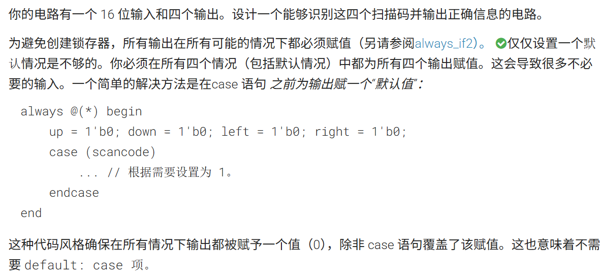


```verilog
// synthesis verilog_input_version verilog_2001
module top_module (
    input [15:0] scancode,
    output reg left,
    output reg down,
    output reg right,
    output reg up  ); 

    always @(*) begin
        up = 1'b0; down = 1'b0; left = 1'b0; right = 1'b0;
        case(scancode)
            16'he06b:	begin	left = 1'b1;	end
            16'he072:	begin	down = 1'b1;	end
            16'he074:	begin	right = 1'b1;	end
            16'he075:	begin	up = 1'b1;		end
        endcase
    end
endmodule

```

就是使用case语句前现将你的输出都赋值了一个默认的，然后这样的话跑case的时候没出现情况就会使用默认值，不需要使用default了。