### 必读

| 节               | 页       | 说明                                                |
| --------------- | ------- | ------------------------------------------------- |
| 1.4.2 反码补码      | 9–12    | 别跳。你后面写 CIC/FIR 全是有符号数,Verilog 的 signed 是经典 bug 源 |
| 5.2 SR锁存器       | 216     | 3 页,理解"反馈产生记忆"                                    |
| 5.3 电平触发的触发器    | 219     | **这就是锁存器**,你的头号缺口                                 |
| 5.5 边沿触发的触发器    | 230     | **这就是 DFF**,和 5.3 对照着读                            |
| 5.6.1 触发器分类     | 236     | 只看 D 触发器,JK/T/SR 扫一眼                              |
| 5.7 触发器的动态特性    | 241     | 建立/保持时间在这里。**只读参数定义,内部电路分析跳过**                    |
| 6.1 概述          | 259     | Mealy 和 Moore 的区别                                 |
| 6.2.1 + 6.2.2   | 262–270 | 状态转换图/表,状态机地基                                     |
| 6.3.1 寄存器和移位寄存器 | 272     | 6 页                                               |
| 6.4.1 同步时序设计方法  | 314     | 状态机设计流程,全书最实用的一节                                  |
| 6.4.2 自启动设计     | 326     | 状态机误入非法状态能否自己爬回来,做芯片必须考虑                          |

### 略读

- **2.5.2 逻辑函数的表示方法**——建立真值表↔电路的对应感,不用刷题
- **2.6.2 卡诺图**——知道综合器在干什么就行
- **4.2 分析与设计方法**、**4.3.2 译码器**、**4.3.3 数据选择器**——只看功能不看门级。数据选择器多看一眼,你写的 `case` 综合出来就是它
- **4.4.1 竞争-冒险成因** + **6.5**——看完就明白同步设计范式在解决什么问题
- **1.5 编码**——只挑格雷码,BCD 跳过
- **7.3.1 SRAM**、**7.5 用存储器实现组合逻辑函数**——后者是 LUT 思想的来源

### 整章跳过

**第三章**(门电路)、**第十章**(脉冲波形)、**第十一章**(数模转换)。

第十一章特别说一句:那些权电阻网络、倒 T 形网络的内容,你做 SAR ADC 的水平远在这本书之上,看了纯属浪费时间。

**第八章**基本全跳。PAL/GAL/EPLD/ispGDS 是九十年代的东西,8.7 的 FPGA 描述也已经严重过时。

**第九章"硬件描述语言简介"——这一章你千万别拿来学 Verilog。** 正文不到十页,写法停留在二十年前,很容易学到一堆坏习惯(比如不分组合/时序块、乱用阻塞赋值)。真要学就 HDLBits。

### 必须背下来的(就这七条)

1. **锁存器电平敏感,触发器边沿敏感**;组合 `always` 块里漏赋值 → 综合出锁存器
2. **T_clk > T_cq + T_组合 + T_setup**——整个数字设计的地基
3. **D 触发器特性方程 Q(n+1) = D**。JK/T/SR 的特性方程不用背,RTL 里你只会用 D
4. **德摩根定律**——写条件判断时天天用
5. **补码三条**:负数怎么表示、符号扩展往高位补符号位、加法结果位宽 +1 / 乘法位宽相加
6. **格雷码相邻码字只变 1 位**——记住这条性质就够,编码规则用到时再查
7. **Mealy 输出跟输入走会有毛刺,Moore 输出只跟状态走更干净**

其余全部理解一次即可,不用记。卡诺图、逻辑代数各种定理、74 系列型号,以后一次都不会用到。

### 三个陷阱

**5.4 脉冲触发的触发器(主从结构)跳过。** 它的"一次变化问题"是主从 JK 特有的历史缺陷,边沿触发出现后就被淘汰了。看了只会增加困惑。

**"异步时序逻辑电路"(6.2.3、6.4.3)不是跨时钟域。** 它指没有统一时钟、靠传播延迟工作的电路,分析要画流态图查竞态,纯考研内容。你以后要处理的 CDC 是完全另一套东西。

**6.3.2 计数器有 31 页,只看前 5 页。** 同步计数器原理看一下,后面 74LS161/74LS90 级联接 N 进制那一大段直接跳——RTL 里就一句 `cnt <= cnt + 1'b1;`。


## 1.4.2反码、补码和补码运算
**原码**：用符号位表示这个二进制数的正负，符号位为0表示这个数是正数，符号位为1表示这个数是负数。

补码：举例说明

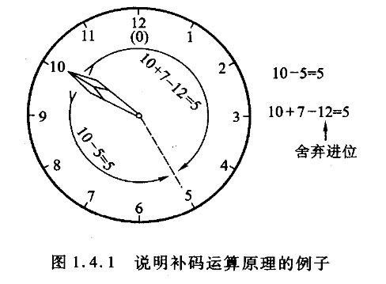

如图：每逢12进位，然后从10点调到5点
方法1:10-5=5
方法2:10+7-12=5
12进位被舍弃了。这里称7为-5对模12的补数------补码(complement)

==结论：==减去某个数可以用加上它的补码来代替。

举例：四位二进制数

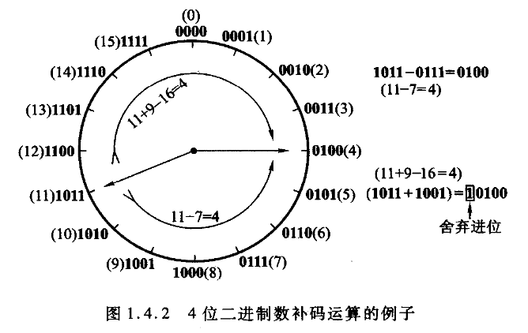

```verilog
1011 - 0111 = 0100 
11 - 7 = 4
%补码运算
11 + 9 - 16 = 4
1011 + 1001 = 1_0100
```
注：补码就是 `0111` 取反再加 `1` 得到的 `1001`   


使用之前需要先声明：
### 用法一：只要正数(这种方法的算范围是0~15，超出范围无法计算)

16 个号码从头排到尾：0、1、2……一直到 15。
存数的时候是不需要转化为补码的，但是再算减法的时候需要转换为补码的形式计算。
但是在算加法的时候如果超出了计算的范围那么久会出错。

### 用法二：也要负数(这种声明的方式的计算范围是-8~7超过范围无法计算，比如6+6 = 12，无法计算，称为溢出)

那就把**后面 8 个号码拿去表示负数**：存的时候就转换为补码进行存储。在计算的时候使用了补码的话计算的经过要减去16.   


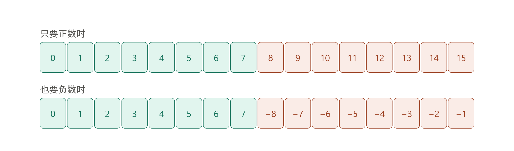

**绿的那半，两行一模一样。红的那半，改了名。**（红的那半就是补码）

改名规则：每个都减 16。8−16=−8；9−16=−7……15−16=−1。

**这就是补码。没别的了。**


例：算-11+7的话
第一种声明的方式：也需要将-11转换为补码(符号在谁身上就转换谁)，就是5，然后计算5+7 = 12
那么这个值显然是不对的。所以这个东西只能用第二种声明的方式
第二种声明的方式：-11+7，也是-11转化为补码形式，就是5，计算5+7 = 12,12-16= -4，结果就是-4。


## 1.5格雷码Gray Code
格雷码的编号方式：从高位到低位竖向看分别为A,B,C,D，那么最低位D按照0110的方式编码，C按照00111100方式，B按照000011110000，最高位A按照0000000011111111方式编码(只有一半)

| 编码顺序 | 二进制代码 | 格雷码  |  A  |  C  |  B  |  D  |
| :--: | :---: | :--: | :-: | :-: | :-: | :-: |
|  0   | 0000  | 0000 |  0  |  0  |  0  |  0  |
|  1   | 0001  | 0001 |  0  |  0  |  0  |  1  |
|  2   | 0010  | 0011 |  0  |  0  |  1  |  1  |
|  3   | 0011  | 0010 |  0  |  0  |  1  |  0  |
|  4   | 0100  | 0110 |  0  |  1  |  1  |     |
|  5   | 0101  | 0111 |  0  |  1  |  1  |     |
|  6   | 0110  | 0101 |  0  |  1  |  0  |     |
|  7   | 0111  | 0100 |  0  |  1  |  0  |     |
|  8   | 1000  | 1100 |  1  |  1  |     |     |
|  9   | 1001  | 1101 |  1  |  1  |     |     |
|  10  | 1010  | 1111 |  1  |  1  |     |     |
|  11  | 1011  | 1110 |  1  |  1  |     |     |
|  12  | 1100  | 1010 |  1  |  0  |     |     |
|  13  | 1101  | 1011 |  1  |  0  |     |     |
|  14  | 1110  | 1001 |  1  |  0  |     |     |
|  15  | 1111  | 1000 |  1  |  0  |     |     |
|      |       | ABCD |     |     |     |     |
优点：转换过程中不产生过渡'噪声'，例如二进制码0011早转换为0100工程中，最后一位的变化比前两位慢，会出现短暂的0101这个状态，这个转态将成为转换过程中的噪声。


### 2.5.2 逻辑函数的表示方法
波形图→真值表→逻辑表达式→化简逻辑表达式

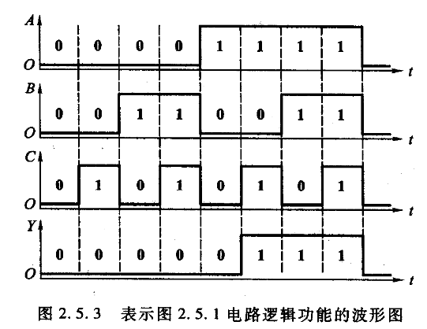


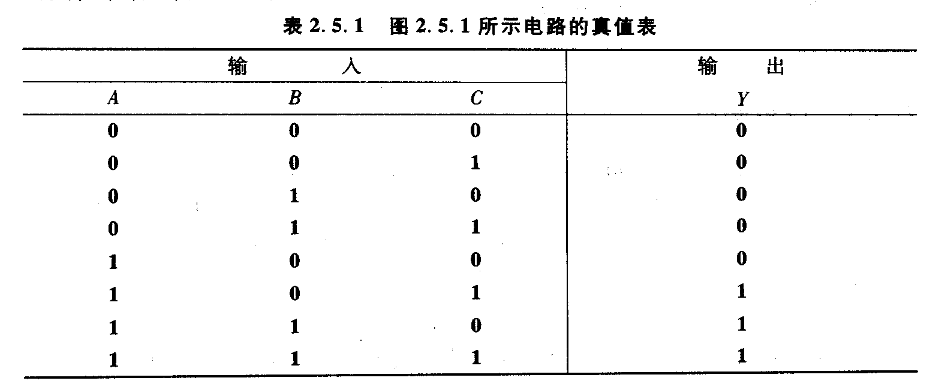

写出逻辑表达式：然后化简

```verilog
由真值表知：AB'C = 1;ABC' = 1;ABC = 1得
Y =  AB'C + ABC' + ABC
```


### 2.6.2 卡诺图化简

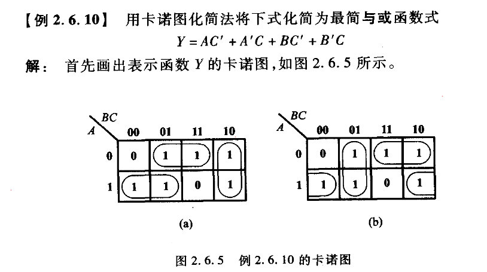

```verilog
Y = AB' + A'C + BC'    %(a)
Y = AC' + B'C + A'B    %(b)
```

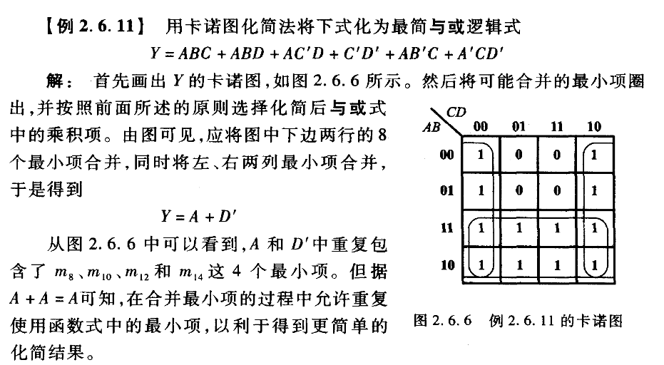


### 4.2 分析与设计方法
例：红绿灯问题
1. 根据问题进行逻辑抽象(就是得到真值表)
2. 根据真值表写出逻辑函数式
3. 化简(卡诺图)(公式法)
4. 根据化简结果画出逻辑电路图

#### 4.3.2 译码器Decoder(只看功能不看门级)

3线-8线译码器真值表：

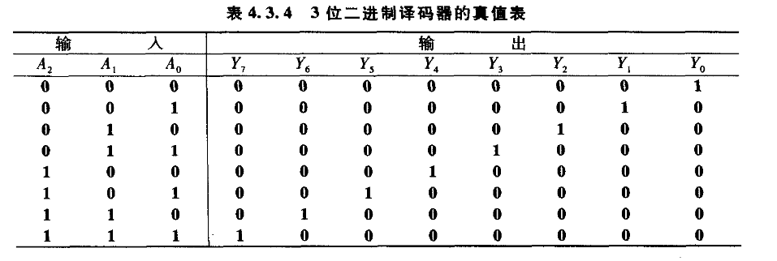

逻辑为:  $Y_{0}'$  到 $Y_{7}'$  同时又是 $A_{2},A_{1},A_{0}$  这三个变量的全部最小项的译码输出，所以也将这种译码器称为最小项译码器。 

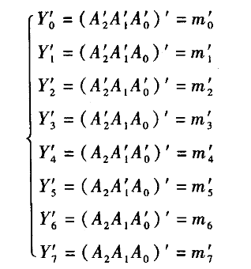


### 4.3.3 数据选择器(只看功能不看门级电路)

数字电路在传输过程中，有时候需要从一组输入数据中选出某一个，这是就需要用到数据选择器。

称为数据选择器(Data Selector) 或 多路开关(Multiplexer)

4-1数据选择器：

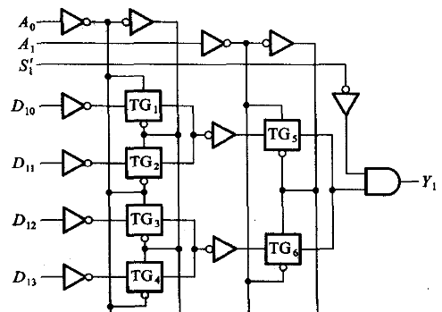

输出逻辑表达式：

$$
Y_{1} = [D_{10}(A_{1}' A_{0}’) + D_{11}(A_{1}' A_{0}) + D_{12}(A_{1} A_{0}') + D_{13}(A_{1} A_{0})] \cdot S_{1}
$$
 $S_{1}$  为控制端， $A_{1},A_{0}$  为选择端


### 4.4.1 竞争-冒险成因

竞争现象:
定义：我们将门电路两个输入信号同时向反向逻辑电平跳变(一个从1变为0，另一个从0变为1)的现象称为竞争。
竞争-冒险：由于竞争而在电路输出端产生尖峰脉冲的现象就称为竞争冒险。

如图：与门为例
稳态的时候无论是A = 1、B = 0还是A = 0、B = 1，输出的结果都是0；但是输入信号A从1跳变到0的时候，如果B从0跳变为1，且B线上升到  $V_{IL(max)}$  以上，这样的话AB同时处在高于  $V_{IL(max)}$  的状态，就会产生一个极窄的Y = 1 的尖峰脉冲。


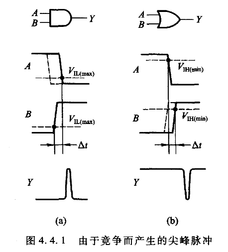


### 5.2 SR锁存器
基本结构：

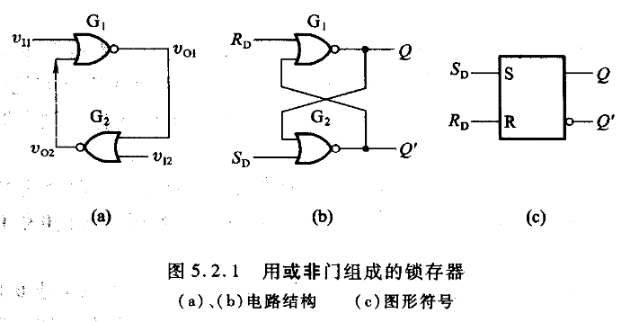

特性表：

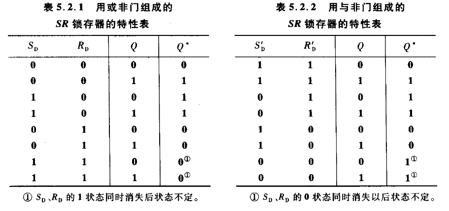

或非门：正常工作时输入信号要遵守  $S_{D}R_{D} = 0$  的约束条件，不允许输入 $S_{D} = R_{D} = 1$  的信号

与非门：正常工作时输入信号要遵守  $S_{D}R_{D} = 1$  的约束条件，不允许输入 $S_{D} = R_{D} = 0$  的信号


### 5.3电平触发的触发器

电平触发SR触发器(同步SR触发器)：只有CLK为高电平的时候RS触发器才有用。

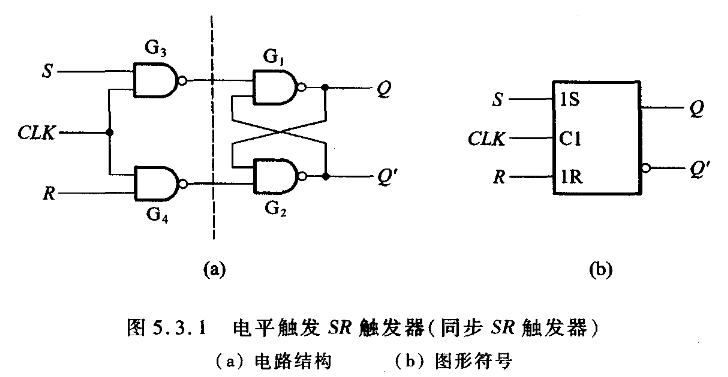

只有CLK(触发信号)变为高电平后，触发器才能按照输入的置1、置0信号置成相应的状态。

特性表：

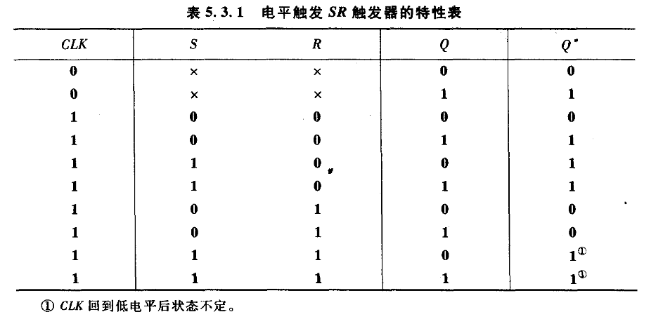

### 5.5边沿触发的触发器
边沿触发的D触发器：(两个电平触发的D触发器串联)

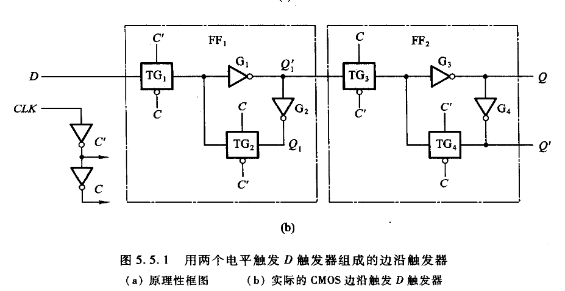

CLK = 0，时TG1和TG4导通，D的信号直接传给Q1即 $Q_{1} = D$ ，在CLK为0期间Q1随着D的变化变化，同时FF2维持原来的状态。
CLK = 1，时TG2和TG3导通，由于FF1的存储效应，Q1的状态不会变，同时将存储的状态传到FF2，Q变为Q1，Q1的状态通过TG3传到了输出端，使  $Q^{*} = D$  （CLK上升沿的时候达到D的状态）
边沿触发器的特性表：

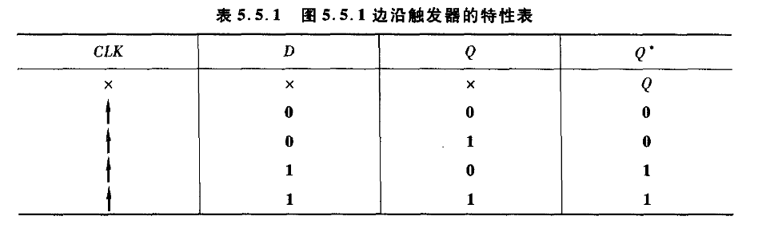

带有异步置位、和复位的边沿触达D触发器：

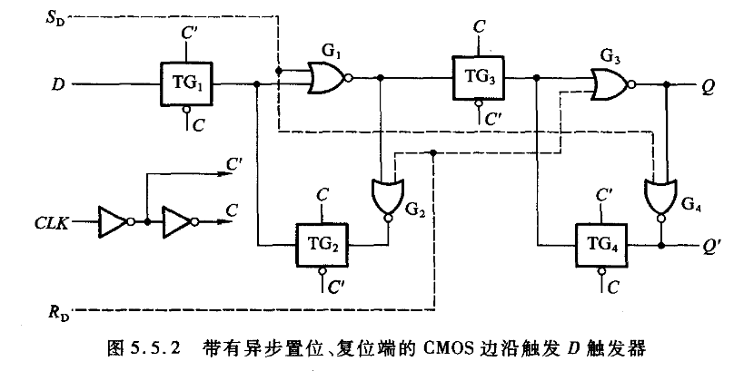


### 5.6.1触发器按逻辑功能的分类(D触发器)
凡是在时钟信号作用下逻辑功能符合下表的所规定的逻辑功能者，无论出发方式如何，均称为D触发器。
特性方程： $Q^{*} = D$  

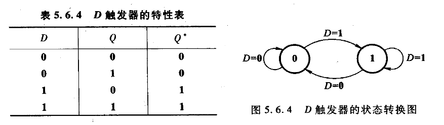


### 5.7触发动态特性
建立/保持时间在这里。只读参数定义,内部电路分析跳过

1. 传输延迟时间 $t_{cq}$ ：从有效触发沿到输出新状态稳定建立所经过的时间。

2. 建立时间  $t_{set}$  ：有效触发沿之前，输入已经稳定的最短时间。

3. 保持时间  $t_{H}$  ：有效触发沿之后，必须继续保持不变的最短时间。


### 6.1概述  Mealy(米利)和Moore(穆尔)的区别
分类依据：根据输出信号的特点就爱那个时序电路分为：Mealy和Moore两种类型。
Mealy：输出信号不仅取决于存储电路的状态，而且还取决于输入变量。
Moore：输出信号仅仅取决于存储电路的状态。(Moore电路知识Mealy电路的一种特例)。


### 6.2.1同步时序逻辑电路的分析方法

分析同步时序电路时一般按照如下步骤进行：
1. 从给定的逻辑图中写出，每个触发器的驱动方程(即每个触发器的输入)
2. 将得到的这些驱动方程带入相应触发器的特性方程中，得到每个触发器的状态方程，从而得到整个时序电路的状态方程组。
3. 根据逻辑图写出输出方程。

以JK触发器为例：

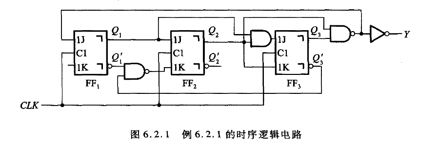

驱动方程：


$$
\begin{cases}
J_{1} = (Q_{2} \cdot Q_{3})' & K_{1} = 1    \\
J_{2} = Q_{1} & K_{2} = (Q_{1}' \cdot Q_{3}')'\\ 
J_{3} = Q_{1} \cdot Q_{2} & K_{3} = Q_{2}
\end{cases}
$$

带入JK触发器的特性方程 $Q^{*} = J  Q' + K' Q$  得到电路的状态方程：

$$
\begin{cases}
Q_{1}^{*} = (Q_{2} \cdot Q_{3})' Q_{1}'  \\
Q_{2}^{*} = Q_{1} \cdot Q_{2}' + Q_{1}' \cdot Q_{3}' \cdot Q_{2} \\
Q_{3}^{*} = Q_{1} \cdot Q_{2} \cdot Q_{3}' + Q_{2}' \cdot Q_{3}
\end{cases}
$$

写出输出方程：

$$
Y = Q_{2} \cdot Q_{3}
$$


### 6.2.2时序逻辑电路的状态转换表、状态转化图、状态机流程图和时序图

设电路的初态为 $Q_{3}Q_{2}Q_{1} = 000$  带入上例可得：

$$
\begin{cases}
Q_{3}^{*} = 0 \\
Q_{2}^{*} = 0 \\
Q_{1}^{*} = 1 \\
\end{cases}
$$


$$
Y = 0
$$
将这一组结果作为新的初台，再次带入原式，又可以得到新的次态和输出值：就可以得到了状态转换表：

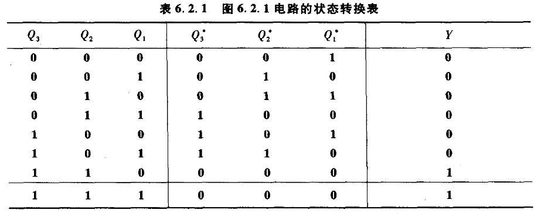


计算过程中只有7种状态，缺少  $Q_{3}Q_{2}Q_{1} = 111$  这个状态带入状态方程可以得到：


$$
\begin{cases}
Q_{3}^{*} = 0 \\
Q_{2}^{*} = 0 \\
Q_{1}^{*} = 0 \\
\end{cases}
$$


$$
Y = 1
$$
补充到表中，得到完整的状态转换表。
由下表可知每7次进行一次循环：

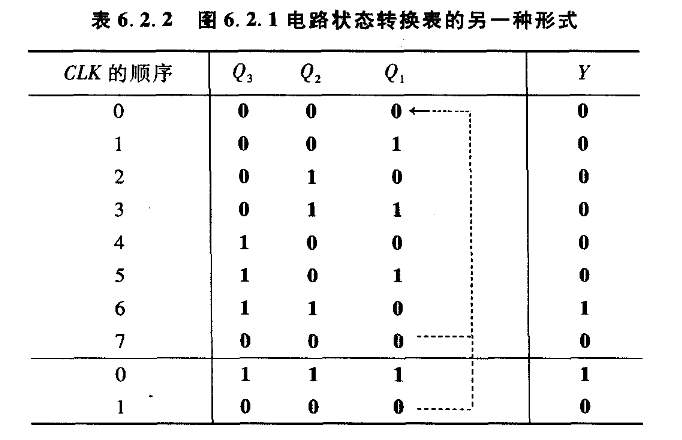


状态转化图：

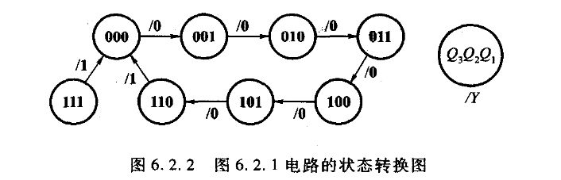


三. 状态及流程图(state machine cahrt 即SM图)
可以理解为：是状态转换图按照时钟信号顺序展开的一种形式，更直观地表示出时序电路的运行过程。

SM图中使用图形符号：状态框、判断框、条件输出框

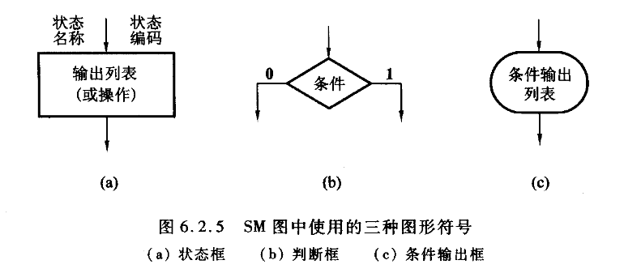


举例：书6.2.3
状态转换表和图：

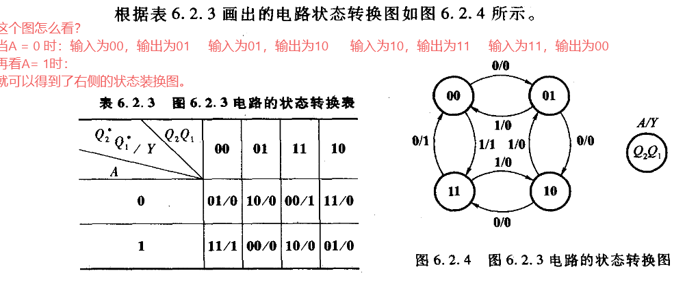


根据这个状态转换表可以画出：

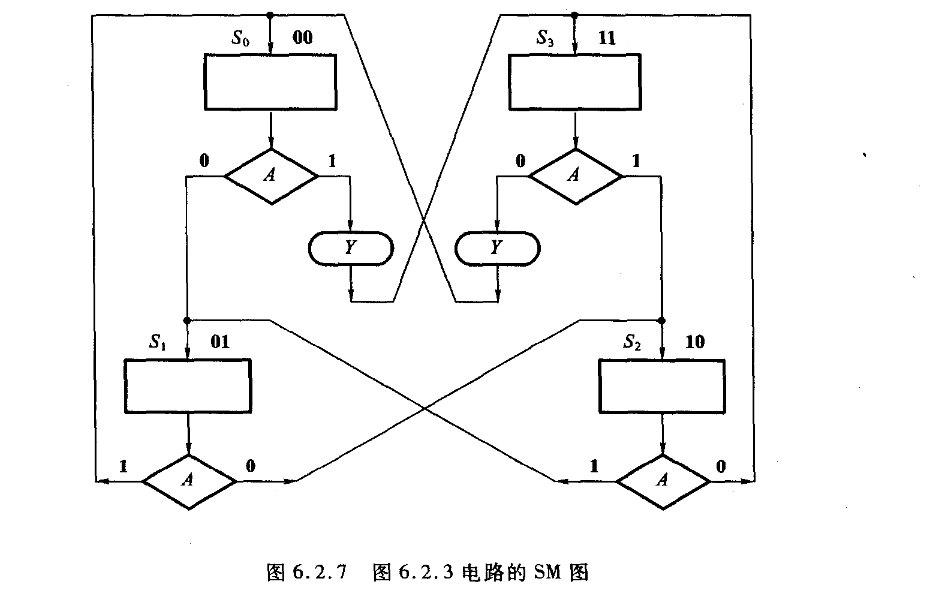

四.时序图

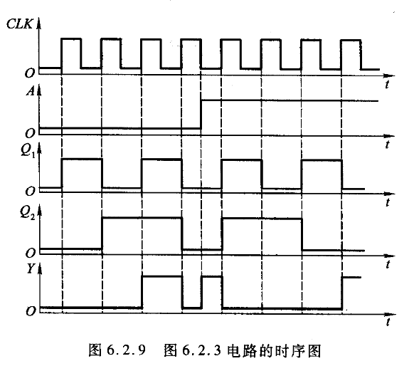


### 6.3.1 寄存器和移位寄存器

一.寄存器 Register
一个触发器可以存出1位二进制码，所以用N个触发器组成的寄存器可以存储一组N位的二进制码
举例：

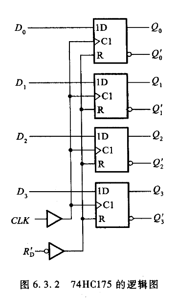

触发器的输出状态仅取决于CLK上升沿到达时刻D端的状态。

特点：接收数据时所有各代码是同时输入的，而且触发器中的数据数并行地出出现在输出端的，将这种输入输出方式称为并行输入、并行输出方式。

二. 移位寄存器 shift register

1. 移位寄存器：除了具有存储代码的功能外还有移位功能。
2. 移位：寄存器里存储的代码能在脉冲的作用下依次左移或者右移。同时可以实现数据的串行-并行转换、数值计算以及数据处理

D触发器构成的4位移位寄存器

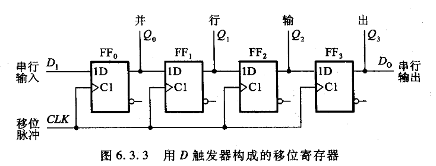

移位寄存器中各代码的移动情况：每个脉冲信号码值都会向右移动一位。

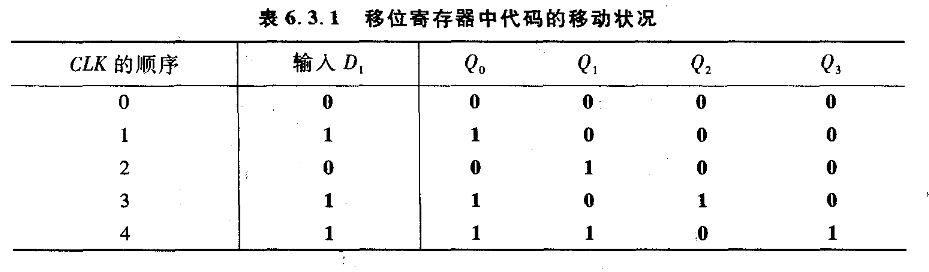 
如图为电路电压波形图：

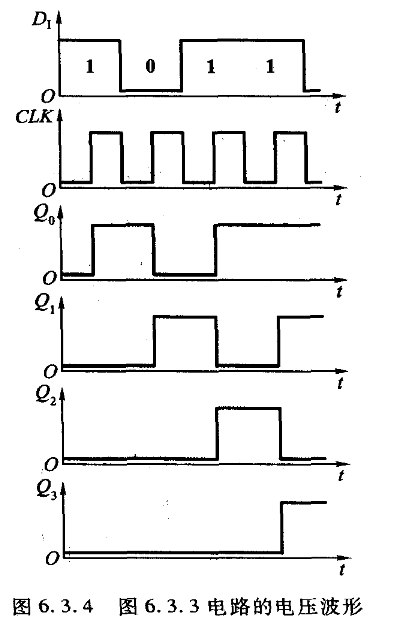


| 6.4.1 同步时序设计方法 | 314 | 状态机设计流程,全书最实用的一节 |
| -------------- | --- | ---------------- |
### 6.4.1同步时序设计方法

设计同步时序逻辑电路时，一般按照如下步骤进行：

一、逻辑抽象，得出电路的状态转换图或者状态转换表
二、状态简化
三、状态分配(状态编码)
四、选定触发器的类型，求出电路的状态方程、驱动方程、输出方程
五、根据得到的方程式画出逻辑图
六、检查设计的电路能否自启动

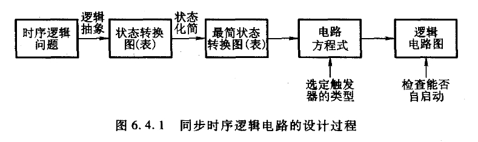

举例： 6.4.1设计一个带有进位输出端的十三进制计数器

按照题意画出状态转换图：一共13个状态，然后在最后一个状态的时候产生进位。

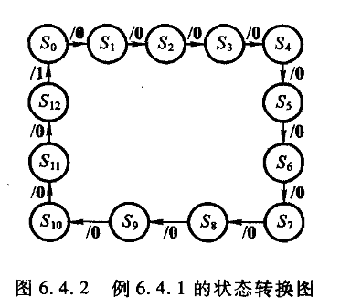

已知有13个状态，则M=13，故应取触发器位数n = 4，因为：

$$
2^{n - 1} < M < 2^{n} \to 2^{3} < 12 <2^{4}
$$

可以取 0000 ~ 1100 作为 $S_{0} \to S_{12}$  的编码：

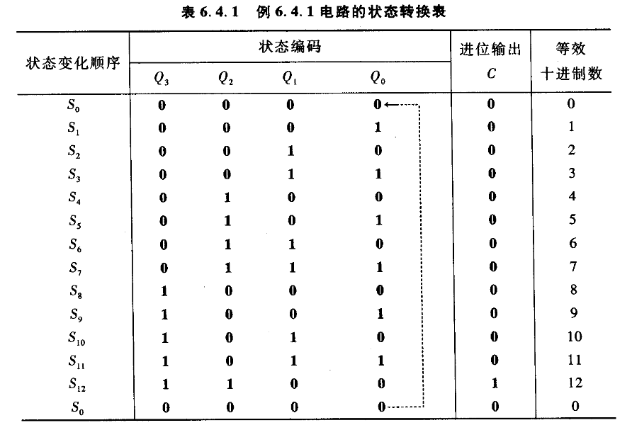

根据上面的状态转还表可以得到下面的电路次态/输出卡诺图，然后分解卡诺图，可以分别得到：   $Q_{3}^{*} \,, Q_{2}^{*} \,, Q_{1}^{*} \,, Q_{0}^{*} \,, C$   
 
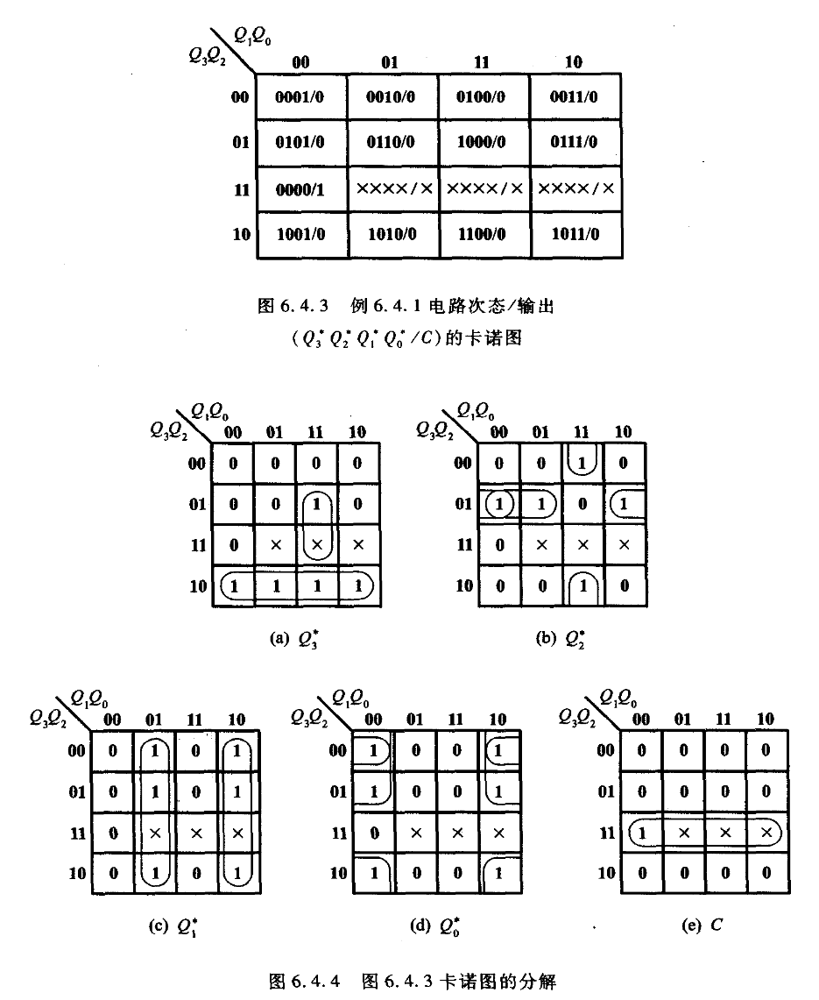

然后根据状态转换图可以得到状态方程：

$$
\begin{cases}
Q_{3^{*}} = Q_{3} Q_{2}' + Q_{2} Q_{1} Q_{0} \\
Q_{2^{*}} = Q_{3}' Q_{2} Q_{1}' + Q_{3}' Q_{2} Q_{0}' + Q_{2}' Q_{1} Q_{0} \\
Q_{1^{*}} = Q_{1}' Q_{0} + Q_{1} Q_{0}' \\
Q_{0^{*}} = Q_{3}' Q_{0}' + Q_{2}' Q_{0}' \\
\end{cases}
$$
输出方程为：

$$
C = Q_{3} Q_{2}
$$
书中选的是JK触发器， $Q……{*} = J Q' + K' Q$  将状态方程改写为JK触发器的形式：

$$
\begin{cases}
Q_{3^{*}} = Q_{3} Q_{2}' + Q_{2} Q_{1} Q_{0}(Q_{3} + Q_{3}') = (Q_{2 Q_{1} Q_{0}})Q_{3}' + Q_{2}' Q_{3} \\
Q_{2^{*}} = (Q_{1} Q_{0}) Q_{2}'  + (Q_{3}' (Q_{1} Q_{0})') Q_{2}\\
Q_{1^{*}} = Q_{0} Q_{1}' + Q_{0}' Q_{1} \\
Q_{0^{*}} = (Q_{3}' + Q_{2}') Q_{0}' + 1' \cdot Q_{0} = (Q_{3} + Q_{2})'Q_{0}' + 1' \cdot Q_{0}\\
\end{cases}
$$

由上式可得驱动方程为：

$$
\begin{cases}
J_{3} = Q_{2} Q_{1} Q_{0} & K_{3} = Q_{2} \\
J_{2} = Q_{1} Q_{0} & K_{2} = (Q_{3}' (Q_{1} Q_{0})')' \\
J_{1} = Q_{0} & K_{1} = Q_{0}  \\
J_{0} = (Q_{3} Q_{2}) & K_{0} = 1
\end{cases}
$$

得到完整的电路图为：将三个无效状态带入看能否自启动：1101、1110、1111 得到次态为：0010、0010、0000故可以自启动。

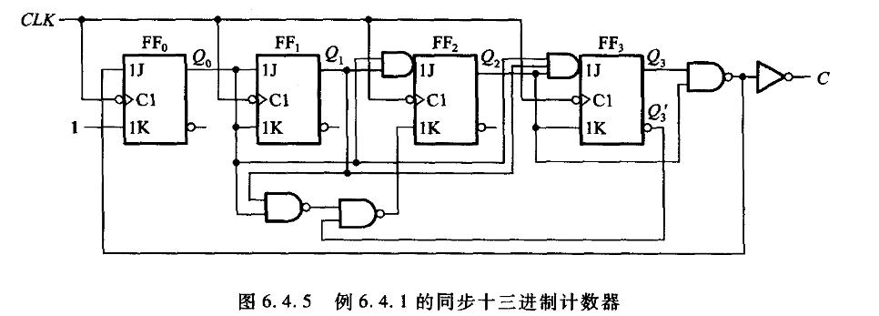


得到完整的状态转换图：

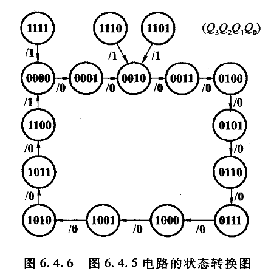


例6.4.2：设计一个串行数据检测器，对他的要求是：连续输入3个或者3个以上的1时输出为1，其他情况输出为0。


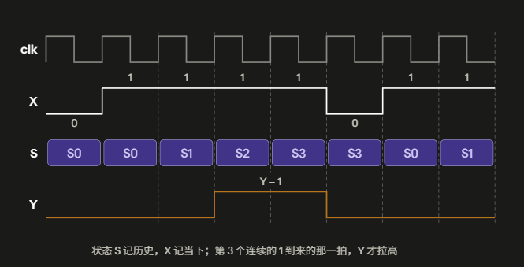

状态转换表： X为输入，Y 为输出

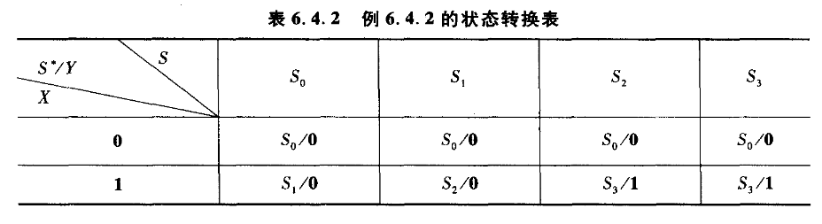

解释：
1. 第一行：X = 0；输入为0无论输入几个1了都为0。
2. 第二行：输入为1时，初态为 $S_{0}$ 说明只输入一个1，输出次态为  $S_{1}$ 输出还是0,； 当输入还是1时，初态为  $S_{1}$ 说明已经输入两个1了，输出次态为  $S_{2}$  ；  当输入还是1时，初态为  $S_{2}$ 说明已经输入两个1了，输出次态为  $S_{3}$  这时输出 Y变为1，再输入1时还是这样。

状态转换图为：右图为化简图，比较状态转换表中的 最后两列发现状态是一样的即 $S_{2}$  $S_{3}$  是等价的状态。故可以合并为一个状态。

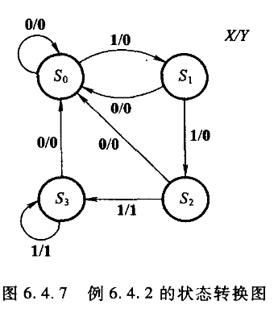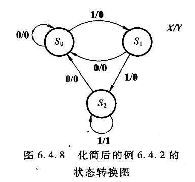


电路状态 M = 3 ， 故取触发器的个数为 n = 2；

电路的次态/输出卡诺图：

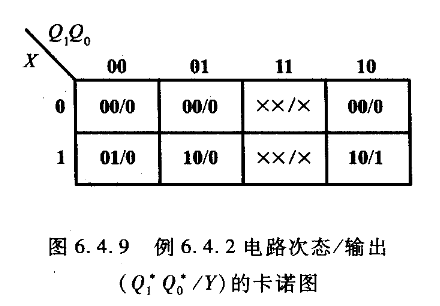

卡诺图分解：

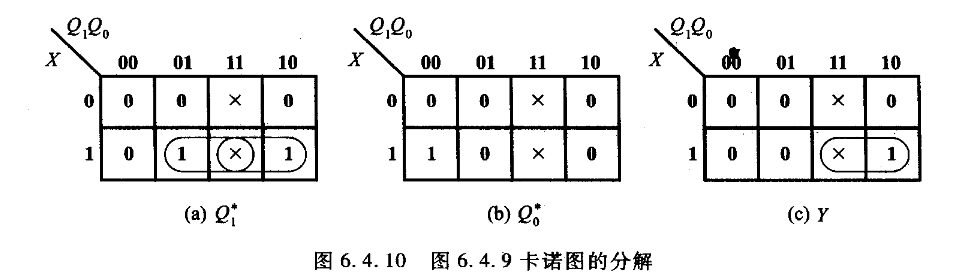

得到状态方程为：

$$
\begin{cases}
Q_{1}^{*} &= X Q_{1} + X Q_{0} = X Q_{1} + X Q_{0} \, (Q_{1} + Q_{1}') \\ &= (X Q_{0}) \, Q_{1}' + X Q_{1} \\[4pt] Q_{0}^{*} &= X \, Q_{1}' \, Q_{0}' = (X \, Q_{1}') \, Q_{0}' + \mathbf{1}' \, Q_{0}
\end{cases}
$$

由上式得驱动方程：
$$
\begin{cases}
J_{1} = X Q_{0} \, & K_{1} = X' \\
J_{0} = X Q_{1}' \, & K_{0} = \mathbf{1}
\end{cases}
$$

输出方程：

$$
Y = X Q_{1}
$$

完整电路：

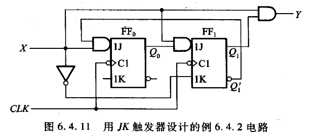


状态转换图：当电路进入无效状态11后，若X= 1则次态转入10，如X= 0则次态进入00。

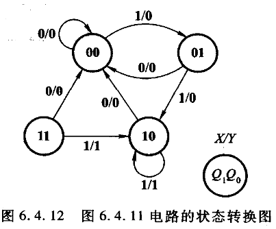

若使用D触发器： $Q^{*} = D$  
则驱动方程为：

$$
\begin{cases}
D_{1} = X Q_{1} + X Q_{0} = X (Q_{1}' Q_{0}')' \\ 
D_{0} = X Q_{1}' Q_{0}'
\end{cases}
$$

电路：

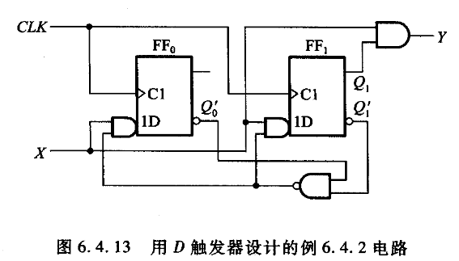


| 6.4.2 自启动设计     | 326     | 状态机误入非法状态能否自己爬回来,做芯片必须考虑                          |
| --------------- | ------- | ------------------------------------------------- |


**6.5**——看完就明白同步设计范式在解决什么问题

**7.3.1 SRAM**、**7.5 用存储器实现组合逻辑函数**——后者是 LUT 思想的来源


